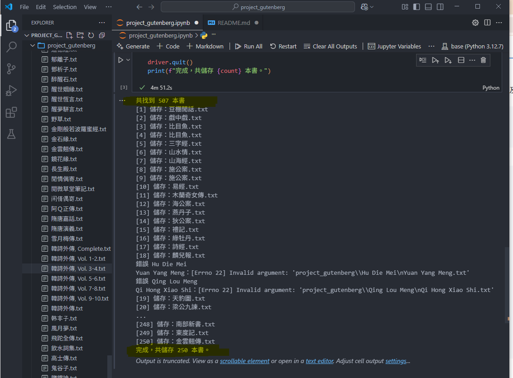
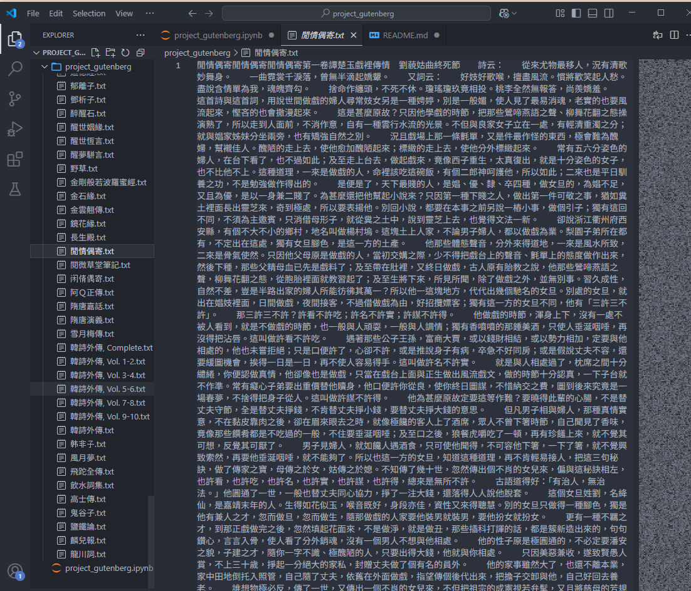
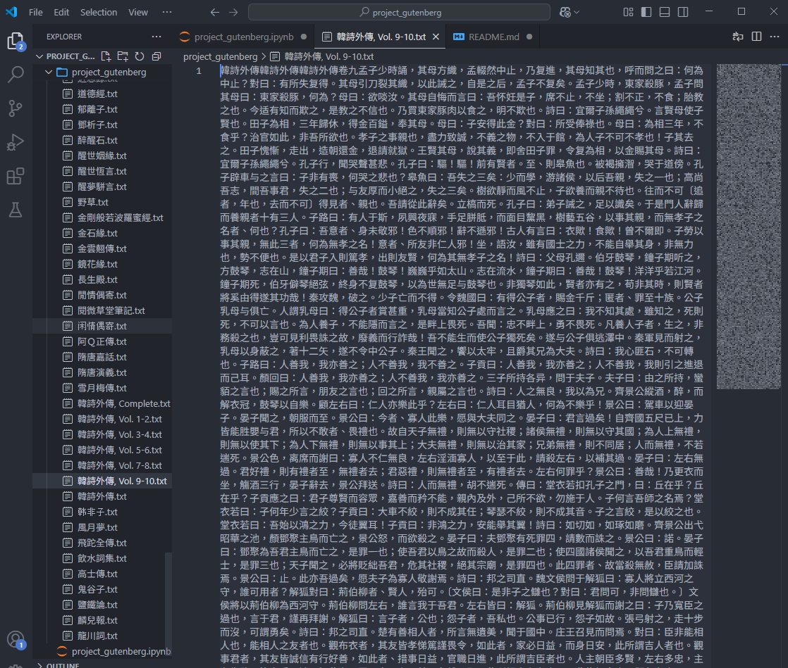
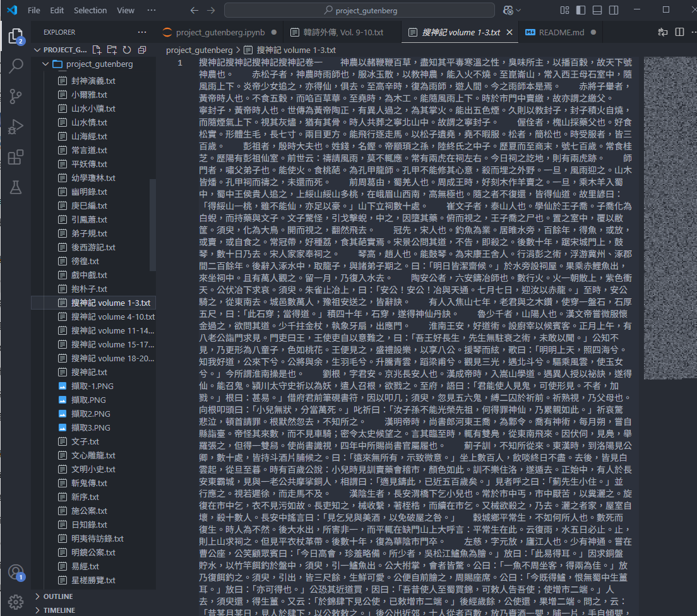

# Project Gutenberg 中文電子書爬蟲
本專案使用 Selenium 自動化爬取 [Project Gutenberg](https://www.gutenberg.org/browse/languages/zh) 的 **中文書籍內容**，清除英文及全型英數，只保留純中文內容並儲存為 `.txt` 檔案。所有書籍均儲存在 `project_gutenberg/` 資料夾中。

## 🎯專案目標
- 自動爬取 Project Gutenberg 中文書籍
- 過濾英文、全型英數與無效內容
- 儲存為純中文 `.txt` 檔
- 至少下載 200 本以上（實際數量見下方）
- 上傳至 GitHub 並附上執行影片

## 🧰安裝套件
以下為本專案使用之 Python 套件及版本：
- selenium==4.3.1
- beautifulsoup4==4.12.3
- requests==2.31.0
- tqdm==4.66.1

## 📊成果
- 共儲存書籍：250 本
- 每本書皆為純中文內容（無英文字）
- 書名即為 .txt 檔名

## 🖼執行畫面截圖
以下是爬蟲執行與結果畫面截圖：
- 檔案總數驗證（顯示超過 200 本）
- 檢查個別 txt 為純中文內容

- 第一本

- 第二本

- 第三本

## 🎥 作業影片驗證
[BDSE37-14-Project Gutenberg 中文電子書爬取](https://youtu.be/xQYGsyXhy2A)
影片內容包含：
- 程式執行流程（自動開啟瀏覽器 + 自動存檔）
- 隨機開啟 3 本 .txt 驗證內容為純中文
- 顯示檔案總數
